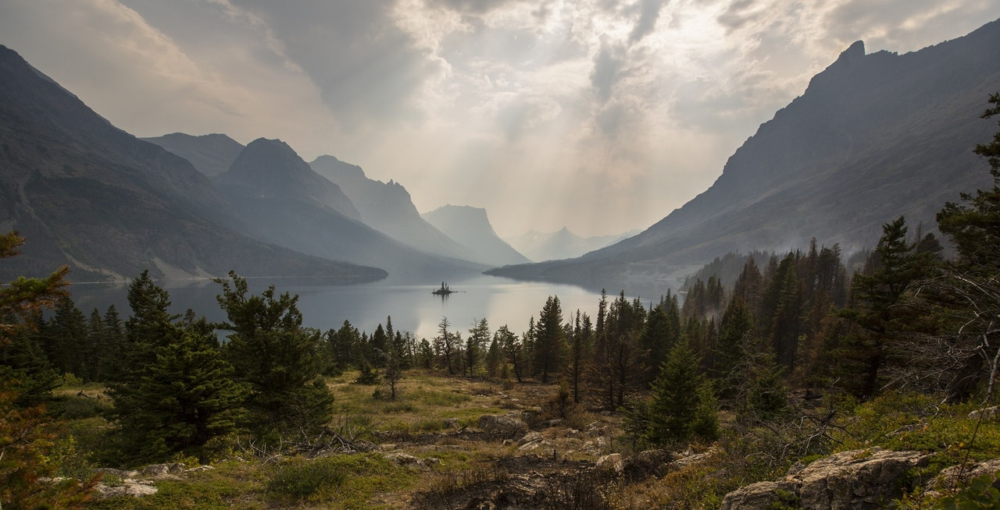

# Pearls
Image reproduction using smaller pearl-like images.

## Dependencies
- OpenCV

## Configuration
Options may be specified in a .toml file. See the config.toml file in the project root for examples. If ran through Cargo, the file will be read from the project root. If the project is ran straight from the executable, it will attempt to read the config from the same directory. Custom locations to config files may be specified using the -c flag.

## Flags
- -i Specify path to input image[^1]
- -o Specify path to where the output image is to be stored[^1]
- -c Specify path to where the config file is located

[^1]: Options specified with these flags override options in the config file

## Results
### Original

### Non-filtered

### Filtered

## Credits
Images courtesy of Wikimedia Commons and Pexel.
